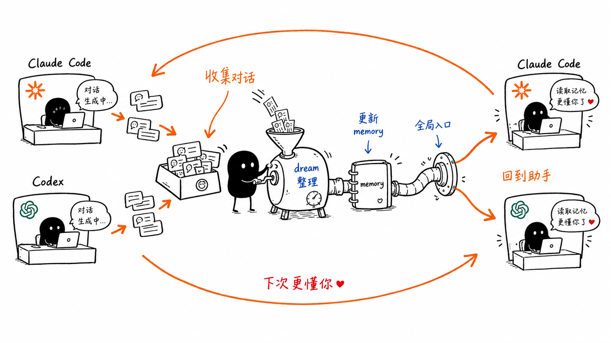

# context-harness

[English](README.md)



`context-harness` 是一个本地优先的个人 AI 上下文工具。它可以把你在本机 AI 编程助手里的对话归档下来，方便之后同步、检索和整理记忆。

已支持的本地 AI 编程助手：

- <a href="https://developers.openai.com/codex/app"></a> [Codex](https://developers.openai.com/codex/app)
- <a href="https://docs.anthropic.com/en/docs/claude-code/overview"></a> [Claude Code](https://docs.anthropic.com/en/docs/claude-code/overview)

项目采用“程序”和“个人数据”分离的设计。这个仓库只放工具本身；你的对话、记忆、日志和同步状态会保存在可配置的数据目录中，例如 `~/.context-harness`。

## 普通用户快速安装

如果你只是想把它装起来用，不需要先理解插件、skills 或命令行细节。优先用下面两种方式之一。安装完成后，你会得到：

- 个人数据目录：`~/.context-harness`
- 程序运行目录：`~/.local/share/context-harness`
- Codex / Claude Code 的自动同步设置（安装脚本会自动检测，也可以手动指定）

### 方式 A：复制一行命令

macOS / Linux 用户可以直接复制这一行到终端（Terminal）：

```bash
curl -fsSL https://raw.githubusercontent.com/yinjialu/context-harness/main/scripts/install.sh | bash
```

如果你只想给某一个 AI 编程助手开启自动同步，可以用：

```bash
curl -fsSL https://raw.githubusercontent.com/yinjialu/context-harness/main/scripts/install.sh | env CONTEXT_HARNESS_AGENTS=codex bash
curl -fsSL https://raw.githubusercontent.com/yinjialu/context-harness/main/scripts/install.sh | env CONTEXT_HARNESS_AGENTS=claude-code bash
```

安装脚本会自动准备 `uv`、下载或更新 `context-harness`、初始化数据目录，并开启对应的自动同步设置。Codex 安装后如果提示需要信任同步 hook，请在 Codex 里运行 `/hooks`，然后确认 `context-harness`。

### 方式 B：把这段话交给本地 AI 编程助手

如果你不想自己打开终端判断环境，可以把下面这段话复制给本机的 Codex、Claude Code 或其他 AI 编程助手：

```text
请帮我在本机安装 context-harness，用来同步和归档我的本地 AI 编程助手对话。

请优先运行这个一键安装脚本：
curl -fsSL https://raw.githubusercontent.com/yinjialu/context-harness/main/scripts/install.sh | bash

安装完成后，请告诉我：
1. 个人数据目录是否已经创建在 ~/.context-harness
2. 程序运行目录是否已经准备在 ~/.local/share/context-harness
3. 已经为 Codex / Claude Code 开启了哪些自动同步设置
4. 如果 Codex 需要我信任 hook，请提醒我运行 /hooks 并确认 context-harness

不要把我的对话、记忆或同步状态放进 context-harness 源码仓库里。
```

如果你已经知道自己只使用 Codex 或只使用 Claude Code，可以把脚本命令改成：

```bash
curl -fsSL https://raw.githubusercontent.com/yinjialu/context-harness/main/scripts/install.sh | env CONTEXT_HARNESS_AGENTS=codex bash
curl -fsSL https://raw.githubusercontent.com/yinjialu/context-harness/main/scripts/install.sh | env CONTEXT_HARNESS_AGENTS=claude-code bash
```

## 快速开始

以下命令默认在 `context-harness` 仓库根目录执行。

克隆仓库：

```bash
git clone https://github.com/yinjialu/context-harness.git
cd context-harness
```

安装依赖：

```bash
uv sync
```

初始化数据目录：

```bash
uv run context-harness --context-home ~/.context-harness init
```

`init` 还会把数据目录里的 `global-claude.md` 绑定到 Agent 级上下文：

- Claude Code：向 `~/.claude/CLAUDE.md` 追加一行 `@import`（文件不存在则创建）。
- Codex：向 `~/.codex/AGENTS.md` 追加一个受管理的 Context Harness 区块（文件不存在则创建），让 Codex 在新会话开始时读取同一份全局上下文文件。

该步骤幂等且非破坏——已有的 `CLAUDE.md` 和 `AGENTS.md` 内容会被保留。首次绑定后需重启 Claude Code 或开启新的 Codex 会话，上下文才会生效。

同步最近一条 Codex conversation：

```bash
uv run context-harness --context-home ~/.context-harness sync codex --latest 1
```

同步最近一条 Claude Code conversation：

```bash
uv run context-harness --context-home ~/.context-harness sync claude-code --latest 1
```

安装自动同步 hooks：

```bash
uv run context-harness --context-home ~/.context-harness hooks install codex
uv run context-harness --context-home ~/.context-harness hooks install claude-code
```

## 自定义数据目录

`context-harness` 支持两种方式指定数据目录：

```bash
CONTEXT_HARNESS_HOME=~/Documents/my-context uv run context-harness init
uv run context-harness --context-home ~/Documents/my-context init
```

`--context-home` 优先级高于 `CONTEXT_HARNESS_HOME`。初始化后可以修改数据目录里的 `config.toml`，自定义 Codex / Claude Code 的原始对话记录位置和归档输出位置。

示例：

```toml
[sources.codex]
enabled = true
sessions_dir = "~/Library/Application Support/Codex/sessions"
output_dir = "conversations/codex"

[sources.claude-code]
enabled = true
projects_dir = "~/Documents/claude-code-projects"
output_dir = "conversations/claude-code"

[memory]
profile_file = "memory/user_profile.md"
global_context_file = "global-claude.md"
```

相对路径会按 `context_home` 解析，绝对路径和 `~` 会保持对应语义。

## 数据目录结构

初始化后，用户数据目录大致如下：

```text
~/.context-harness/
  config.toml
  index.md                 # OKF 根索引
  global-claude.md         # OKF type: Personal Context
  conversations/
    index.md               # OKF 来源索引
    codex/
      index.md             # OKF 索引（渐进式披露）
      log.md               # OKF 日志（倒序时间线）
      20260616_019ed088.md # OKF type: Conversation
    claude-code/
  memory/
    MEMORY.md              # OKF type: Index
    user_profile.md        # OKF type: user
  state/
    codex-sync-state.json
    claude-code-sync-state.json
```

其中：

- `conversations/` 保存从 Code Agent 原始记录渲染出来的 Markdown 归档。
- `memory/` 保存 profile-dreamer 等工作流维护的记忆文件。
- `state/` 保存增量同步状态，用于避免重复处理未变化的 session。
- `config.toml` 只描述本机路径和开关，不需要提交到机制仓库。

### Open Knowledge Format（OKF）

数据家目录本身就是一个原生的 [Open Knowledge Format](https://cloud.google.com/blog/products/data-analytics/how-the-open-knowledge-format-can-improve-data-sharing) 知识库：一个 markdown 文件目录，每个文件带 YAML frontmatter，唯一强制字段是 `type`。对话（`type: Conversation`）、记忆（`type: user|project|feedback|reference|insight`）、个人画像（`type: Personal Context`）以及索引（`type: Index`/`Log`）全部符合 OKF，概念之间用普通相对 markdown 链接互联。

- 新归档由同步 hook 自动写入 OKF frontmatter，无需额外步骤。
- 每次同步后重建 `index.md` / `log.md`，用于渐进式披露和变更历史。
- 把存量数据家目录升级到 OKF，运行幂等迁移命令：

```bash
context-harness migrate-okf --dry-run   # 列出将变更的文件
context-harness migrate-okf             # 原地应用
```

迁移只补齐或修复缺失的标准 frontmatter 字段；未知的 producer 字段和人工正文都会保留，可安全重复运行。

## Skills

仓库内置四个 Agent-facing skills：

- `skills/init-context`：初始化数据目录，并按需安装 Codex / Claude Code hooks。
- `skills/sync-conversations`：手动触发全量或增量 conversation 同步。
- `skills/profile-dreamer`：从归档 conversation 中提取个人画像和 memory 候选更新。
- `skills/adapt-agent-backup`：指导其他 Agent 为新的本地 Code Agent 增加备份适配。

这些 skills 只负责描述 Agent 工作流，实际能力由 CLI 提供，避免把业务逻辑散落到多个 Agent prompt 里。

### 一键复制提示词：增加 Agent 备份适配

把下面这段提示词复制给你想让 `context-harness` 支持的 coding Agent：

```text
请克隆并检查 https://github.com/yinjialu/context-harness。

请使用仓库内的 `adapt-agent-backup` skill，为你当前运行所在的 coding Agent 增加本地 conversation 备份适配，并提交 PR。
```

适配类 PR 如果修改 collector 相关文件，或带有 `agent-backup-adapter` label，会触发轻量 GitHub bot checklist。需要增强版 AI review 时，如果仓库启用了对应集成，可以评论 `@codex review`，或评论 `@claude review this adapter PR against the adapt-agent-backup checklist`。

## Codex Plugin

这个仓库也可以作为 Codex plugin 使用。插件 manifest 位于 `.codex-plugin/plugin.json`，并暴露仓库内的 `skills/` 目录。

### 公开社区安装

Codex 目前还不支持把第三方插件自助发布到官方公开 Plugin Directory。面向社区分发时，先发布 Git marketplace，让用户添加一次：

```bash
codex plugin marketplace add yinjialu/context-harness --ref codex-plugin
```

添加 marketplace 后，用户可以打开 Codex 的 Plugins 页面，切换到 `Context Harness` marketplace source，搜索 `context-harness` 并安装。也可以通过 CLI 安装：

```bash
codex plugin add context-harness@context-harness
```

更新已有安装：

```bash
codex plugin marketplace upgrade context-harness
codex plugin add context-harness@context-harness
```

### Workspace 分享

如果希望同一个 ChatGPT workspace 里的队友可以直接从 Codex app 安装：

1. 先在本机安装插件。
2. 打开 Codex Plugins 页面。
3. 进入 `Created by you` 并打开 `Context Harness`。
4. 选择 `Share`。
5. 添加 workspace 成员或用户组，或复制分享链接。

被分享的人可以在 Codex plugin directory 的 `Shared with you` 中找到并安装该插件。Workspace 分享不会把插件发布到公开 Plugin Directory。

### 发布 marketplace 分支

`codex-plugin` 分支由 `scripts/build_codex_plugin_marketplace.py` 从当前仓库生成。维护者也可以手动发布：

```bash
python3 scripts/build_codex_plugin_marketplace.py
cd dist/codex-plugin-marketplace
git init
git add .
git commit -m "Publish Codex plugin marketplace"
git branch -M codex-plugin
git remote add origin git@github.com:yinjialu/context-harness.git
git push --force origin codex-plugin
```

GitHub Actions workflow 会在推送 `v*` tag 时发布该分支，也支持手动触发。

本地开发时，可以通过个人 Codex marketplace 注册当前 checkout：

```bash
mkdir -p ~/plugins
ln -sfn /path/to/context-harness ~/plugins/context-harness
codex plugin add context-harness@personal
```

这种 symlink 方式会保持当前仓库作为唯一源码，同时匹配 Codex 个人 marketplace 的标准路径布局。

为了让 repo-local skill 自动发现，仓库同时提供了两组相对 symlink：

```text
.agents/skills/      # Codex repo-local skills
.claude/skills/      # Claude Code repo-local skills
```

如果你想把这些 skills 安装为全局可用，可以在本机执行：

```bash
mkdir -p ~/.agents/skills ~/.claude/skills
ln -sfn /path/to/context-harness/skills/init-context ~/.agents/skills/init-context
ln -sfn /path/to/context-harness/skills/sync-conversations ~/.agents/skills/sync-conversations
ln -sfn /path/to/context-harness/skills/profile-dreamer ~/.agents/skills/profile-dreamer
ln -sfn /path/to/context-harness/skills/init-context ~/.claude/skills/init-context
ln -sfn /path/to/context-harness/skills/sync-conversations ~/.claude/skills/sync-conversations
ln -sfn /path/to/context-harness/skills/profile-dreamer ~/.claude/skills/profile-dreamer
```

## Claude Code Plugin

本仓库同时是一个 Claude Code 插件。插件清单位于 `.claude-plugin/plugin.json`，Claude Code 会自动发现仓库的 `skills/` 目录。

### 社区安装

发布 Git marketplace，让用户添加一次：

```bash
/plugin marketplace add yinjialu/context-harness#claude-plugin
```

随后从该 marketplace 安装插件：

```bash
/plugin install context-harness@context-harness
```

也可以通过 CLI 完成同样的流程：

```bash
claude plugin marketplace add yinjialu/context-harness#claude-plugin
claude plugin install context-harness@context-harness
```

更新已安装的插件：

```bash
claude plugin marketplace update context-harness
claude plugin update context-harness@context-harness
```

### 发布 marketplace 分支

`claude-plugin` 分支由 `scripts/build_claude_plugin_marketplace.py` 从本仓库生成。维护者可以手动发布：

```bash
python3 scripts/build_claude_plugin_marketplace.py
cd dist/claude-plugin-marketplace
git init
git add .
git commit -m "Publish Claude Code plugin marketplace"
git branch -M claude-plugin
git remote add origin git@github.com:yinjialu/context-harness.git
git push --force origin claude-plugin
```

`Publish Claude Code Plugin Marketplace` GitHub Actions 工作流也会在推送 `v*` tag 或手动触发时发布该分支。

本地开发时，可将当前 checkout 添加为本地 marketplace：

```bash
/plugin marketplace add /path/to/context-harness
/plugin install context-harness@context-harness
```

Claude Code 会直接读取 checkout 中的 `.claude-plugin/plugin.json`，因此仓库始终是唯一可信来源。

## 通过 skills.sh / gh skill 安装

仓库遵循标准的 `skills/*/SKILL.md` 目录结构，因此可以直接被 skill tooling 从 GitHub 安装。

使用 `npx skills` 一次性安装到 Codex 和 Claude Code：

```bash
npx skills add yinjialu/context-harness --skill '*' -a codex -a claude-code -g -y
```

使用 GitHub CLI `gh skill` 安装：

```bash
for skill in init-context sync-conversations profile-dreamer; do
  gh skill install yinjialu/context-harness "$skill" --agent codex --scope user
  gh skill install yinjialu/context-harness "$skill" --agent claude-code --scope user
done
```

验证可发布的 skill package：

```bash
gh skill publish skills --dry-run
```

发布 tagged release：

```bash
gh skill publish skills --tag v0.1.8
```

`skills/` 是 canonical publish target。直接在仓库根目录运行 `gh skill publish` 可能会提示 `.agents/skills` 和 `.claude/skills`；这两组目录是我们特意保留的 repo-local discovery symlink，用于让 Codex 和 Claude Code 打开仓库时自动发现 skills。

## Skill-only Bootstrap

只安装 skills 不会把完整 CLI 仓库复制到 Agent 的 skill 目录。为了解决这个缺口，每个 skill 都内置了 `scripts/bootstrap.sh`。

Agent 执行 context-harness skill 时，应该先运行：

```bash
runtime_dir="$(bash scripts/bootstrap.sh)"
cd "$runtime_dir"
```

bootstrap 脚本会：

- clone 或更新 runtime repo 到 `~/.local/share/context-harness`
- 默认 checkout `v0.1.8`
- 执行 `uv sync`
- 通过 stdout 输出 runtime repo 路径

之后 Agent 就可以正常执行 CLI 命令：

```bash
uv run context-harness --context-home ~/.context-harness init
uv run context-harness --context-home ~/.context-harness sync codex --latest 1
```

fork 用户可以覆盖 runtime 来源：

```bash
CONTEXT_HARNESS_REPO_URL=https://github.com/<owner>/<repo>.git \
CONTEXT_HARNESS_REF=main \
bash scripts/bootstrap.sh
```

也可以通过 `CONTEXT_HARNESS_RUNTIME_DIR` 自定义 runtime checkout 位置。

## 审计本机版本

升级前后可以先跑这些只读检查：

```bash
context-harness --version
readlink ~/.context-harness
git -C ~/.local/share/context-harness describe --tags --always --dirty
git -C ~/.local/share/context-harness status --short
rg "context-harness" ~/.codex/hooks.json ~/.claude/settings.json
```

平滑升级时，先发布 tagged release，再跑一次 skill bootstrap。bootstrap 会把 `~/.local/share/context-harness` 更新到 skill 内置的默认 tag，除非你用 `CONTEXT_HARNESS_REF` 覆盖：

```bash
bash ~/.agents/skills/sync-conversations/scripts/bootstrap.sh
context-harness --version
```

## Hooks

Hooks 会在受支持 Code Agent 的合适生命周期时机自动调用同步命令，把新 conversation 归档到 `context_home`。

所有受支持的 Code Agent 使用同一套安装模式：默认用户级安装；传 `--scope project` 时安装到项目级。`--project-root` 可以指定另一个项目，否则项目级安装使用当前目录。

Codex hook 默认写入 `~/.codex/config.toml` 和 `~/.codex/hooks.json`：

```bash
uv run context-harness --context-home ~/.context-harness hooks install codex
```

安装项目级 Codex hook 时，在目标项目根目录执行：

```bash
uv run context-harness --context-home ~/.context-harness hooks install codex --scope project
```

如果从 `context-harness` 仓库根目录给其他项目安装，请显式传入目标项目路径：

```bash
uv run context-harness --context-home ~/.context-harness hooks install codex --scope project --project-root /path/to/your-codex-project
```

Claude Code hook 默认写入 `~/.claude/settings.json`：

```bash
uv run context-harness --context-home ~/.context-harness hooks install claude-code
```

安装项目级 Claude Code hook 时：

```bash
uv run context-harness --context-home ~/.context-harness hooks install claude-code --scope project
```

hook installer 是幂等的，重复执行会更新已有的 context-harness sync hook，不会清空已有的其他 hook 配置。

hook 命令会读取 hook stdin 里的 `transcript_path`，优先同步当前结束的 transcript，而不是按全局 mtime 猜最近一条会话。安装时会记录 `context-harness` 仓库绝对路径；安装后如果移动或删除该仓库，需要重新安装 hooks。

Codex 的 command hook 可能需要额外 trust review。安装后如果 Codex 提示 hook 未信任，请在 Codex 里运行 `/hooks` 并确认 `context-harness` hook。

## 在 Codex 中使用

Codex 会从 repo 的 `.agents/skills/` 和用户级 `$HOME/.agents/skills` 发现 skills。打开 `context-harness` 仓库时，内置 skills 会通过 `.agents/skills` 自动暴露；如果你希望在任意项目里使用它们，请按上面的全局 symlink 方式安装到 `~/.agents/skills`。

常用方式：

```text
$init-context 初始化 context-harness，并按需安装 hooks
$sync-conversations 同步 Codex / Claude Code 对话记录
$profile-dreamer 从 conversations 中提取 memory / profile 候选更新
```

也可以用自然语言触发，例如：

```text
使用 sync-conversations 同步最近的 Codex 和 Claude Code 对话
使用 profile-dreamer 从最近归档中提取我的个人画像变化
```

推荐初始化流程：

```bash
uv run context-harness --context-home ~/.context-harness init
uv run context-harness --context-home ~/.context-harness hooks install codex
```

然后在 Codex 里运行 `/hooks`，确认 `context-harness` command hook 已被信任。之后 Codex Stop hook 会把 hook stdin 里的 `transcript_path` 传给 `context-harness`，优先归档当前结束的 transcript。

## 在 Claude Code 中使用

Claude Code 会发现 `.claude/skills/` 下的 project skills，也可以使用用户级 `~/.claude/skills`。打开 `context-harness` 仓库时，内置 skills 会通过 `.claude/skills` 自动暴露；如果你希望在任意项目里使用它们，请按上面的全局 symlink 方式安装到 `~/.claude/skills`。

常用方式：

```text
/init-context
/sync-conversations
/profile-dreamer
```

推荐初始化流程：

```bash
uv run context-harness --context-home ~/.context-harness init
uv run context-harness --context-home ~/.context-harness hooks install claude-code
```

Claude Code hook 默认写入 `~/.claude/settings.json`。Stop hook 会读取 hook stdin 中的 transcript 信息，并把当前会话归档到 `~/.context-harness/conversations/claude-code/`。

## 设计文档

- [docs/superpowers/specs/2026-06-16-context-harness-design.md](docs/superpowers/specs/2026-06-16-context-harness-design.md)
- [docs/superpowers/plans/2026-06-16-context-harness-v1-core.md](docs/superpowers/plans/2026-06-16-context-harness-v1-core.md)

## License

MIT
