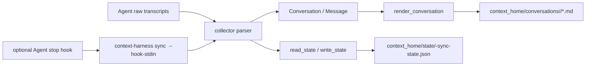

# Agent Backup Adapter Architecture

本文档面向准备给 `context-harness` 增加新 Code Agent 备份适配的维护者或其他 Agent。目标是让对方拿到仓库后，可以按统一路径完成一个新 Agent 的 conversation 归档能力、补测试，并提交 PR。

预期使用方式：

```text
请克隆 https://github.com/yinjialu/context-harness，使用 adapt-agent-backup skill，
为 <agent-name> 完成本地 conversation 备份适配，并提交 PR。
```

## 设计目标

`context-harness` 是本地优先的个人 AI 上下文工具。仓库只保存程序、skills 和测试；用户的 conversation、memory、sync state 保存在 `~/.context-harness` 或用户指定的 `CONTEXT_HARNESS_HOME` 中。

新增 Agent 适配时要保持这几个边界：

- Source adapter 只负责读取该 Agent 的原始 transcript，并转换为统一模型。
- 归档输出统一使用 Markdown，避免每个 Agent 自己定义备份格式。
- 增量同步状态统一写到 `context_home/state/<source>-sync-state.json`。
- 自动备份 hook 是可选层；如果该 Agent 没有稳定 hook 机制，先实现手动 `sync`。
- 不把用户本机 conversation、memory 或 config 提交进仓库。

## 当前架构

核心模块：

- `context_harness/cli.py`：命令入口。注册 `init`、`sync`、`hooks install`、`dream`。
- `context_harness/config.py`：解析 `--context-home`、`CONTEXT_HARNESS_HOME` 和 `config.toml`，输出 `AppConfig`。
- `context_harness/init.py`：初始化数据目录、默认配置和 memory 文件。
- `context_harness/models.py`：统一数据模型：`Conversation`、`Message`、`SyncResult`。
- `context_harness/markdown.py`：把统一模型渲染为 Markdown archive。
- `context_harness/state.py`：读写增量同步状态 JSON。
- `context_harness/collectors/*.py`：每个 Agent 的 transcript parser 和 sync 实现。
- `context_harness/hooks/*.py`：每个 Agent 的 hook 安装器。
- `skills/*`：面向 Agent 的工作流说明，CLI 负责实际行为。

数据流：



## Source Adapter Contract

一个新 source 应该实现这些行为：

1. 读取默认输入目录或 hook 指定的单个 transcript 文件。
2. 忽略坏 JSON、空行、工具事件、内部 meta 事件等不应进入用户归档的内容。
3. 只输出用户和助手的可读消息，角色使用 `user` / `assistant`。
4. 选择稳定的 `session_id`，并尽量保留 title、created time、message time。
5. 对没有可读消息的 transcript 返回 `None`，不创建空 archive。
6. 使用本地日期生成 archive 文件名，遵循现有 `YYYYMMDD_<short-id>.md` 风格。
7. 以 `message_count` 为基础做增量跳过；如果该 Agent 有编辑历史或消息替换行为，再增加更稳定的内容签名。
8. 当 archive 文件名变化时删除旧 archive，避免重复残留。

collector 函数建议签名：

```python
def sync_<source>(
    input_dir: Path,
    output_dir: Path,
    state_path: Path,
    latest: int | None = None,
    all_sessions: bool = False,
    session_path: Path | None = None,
) -> SyncResult:
    ...
```

`session_path` 用于 hook 场景，优先级高于 `latest` 和 mtime 排序。

## 新 Agent 适配步骤

### 1. 调研原始数据

先确认该 Agent 的本机 transcript 存储位置、文件格式、session 组织方式、消息事件结构、时间字段、角色字段和 hook 能力。

最少需要拿到一个 fixture，覆盖：

- user 消息
- assistant 消息
- 工具调用或噪声事件
- title / summary / session metadata
- 坏 JSON 或缺字段容错
- 如果存在 subagent 或分叉 session，需要覆盖 ID 冲突场景

fixture 应放到 `tests/fixtures/<source>-session.jsonl` 或等价测试夹具中，避免放真实用户数据。

### 2. 扩展配置

在 `context_harness/config.py` 中给 `AppConfig` 增加新 source 字段，并在 `load_config` 中读取：

```toml
[sources.<source>]
enabled = true
<input_key> = "~/.example-agent/sessions"
output_dir = "conversations/<source>"
```

如果该 Agent 的输入目录语义是 sessions，用 `sessions_dir`；如果是 projects，用 `projects_dir`；否则可以保持 `input_dir` 并加兼容属性。

同步更新 `context_harness/init.py`：

- `DEFAULT_CONFIG_TEMPLATE` 增加 `[sources.<source>]`
- 初始化 `home / "conversations" / "<source>"`

### 3. 实现 Collector

新增 `context_harness/collectors/<source>.py`，复用现有模式：

- `_parse_time`
- `_safe_name`
- `_read_<source>_session`
- `_archive_path`
- `_remove_stale_archive`
- `sync_<source>`

parser 内部把原始事件转换成：

```python
Conversation(
    source="<source>",
    session_id=session_id,
    title=title,
    created_at=created_at,
    synced_at=datetime.now(UTC),
    messages=[Message(role="user", content="...", created_at=...)],
    metadata={...},
)
```

除非有真实冲突，不要改 `render_conversation`。共享 renderer 是 archive 兼容性的核心。

### 4. 注册 CLI

在 `context_harness/cli.py` 中：

- import `sync_<source>`
- 把 `sync_parser.add_argument("source", choices=[...])` 加上新 source
- 在 `args.command == "sync"` 分支中读取 `config.<source>` 并调用 collector
- disabled source 返回 `_disabled_result("<source>", config.<source>.output_dir)`

如果实现了 hook：

- 新增 `context_harness/hooks/<source>.py`
- import `install_<source>_hook`
- 把 `hooks_install.add_argument("source", choices=[...])` 加上新 source
- 在 `hooks install` 分支写入该 Agent 的配置
- hook 命令应调用 `sync <source> --hook-stdin`

如果没有稳定 hook，不要伪造 hook 支持；保留手动同步即可。

### 5. 更新文档和 skills

至少更新：

- `README.md` 和 `README.zh-CN.md` 的支持列表、示例命令、配置示例、data layout、skills 描述。
- 相关 skill，如 `skills/init-context/SKILL.md` 和 `skills/sync-conversations/SKILL.md`，补充新 source 的命令和限制。

如果新 Agent 需要特殊安装步骤，优先让 CLI 承担行为，skill 只描述工作流。

### 6. 补测试

至少覆盖：

- config 默认路径和自定义路径。
- init 会创建新 source 输出目录和默认配置。
- collector 能写出 Markdown archive。
- collector 会跳过未变化 archive。
- 缺失输入目录返回空 `SyncResult`。
- `latest` 使用 mtime，`session_path` 优先于 mtime。
- 噪声事件不会进入 archive。
- 坏 JSON 不会中断有效消息。
- archive 文件名稳定且长度受控。
- CLI `sync <source>` 成功，disabled source 不创建输出目录。
- 如果有 hook：hook 安装幂等、保留用户原有设置、更新旧命令、避免重复 hook。

运行验证：

```bash
uv sync
uv run pytest
```

## PR 完成标准

PR 应满足：

- 新 source 能通过 `uv run context-harness --context-home <tmp-home> sync <source> --latest 1` 生成 Markdown archive。
- `--all` 和 hook stdin 场景行为清晰；没有 hook 时文档明确说明。
- `config.toml` 默认值、README、skills、测试保持一致。
- 没有提交真实 conversation、memory、state、logs、`.context-harness` 或本机私有配置。
- `uv run pytest` 通过；如果无法运行，PR 描述中说明原因和未验证风险。

## 给其他 Agent 的推荐提示词

```text
请克隆 https://github.com/yinjialu/context-harness，使用仓库内的 adapt-agent-backup skill。

目标：为 <agent-name> 增加本地 conversation 备份适配。

请先阅读 docs/agent-backup-adapter-architecture.md，然后：
1. 调研 <agent-name> 的本机 transcript 路径、格式、消息字段和 hook 能力。
2. 新增 collector、配置、CLI 注册和必要 hook。
3. 更新 README、skills 和测试 fixture。
4. 运行 uv run pytest。
5. 提交一个小而完整的 PR，PR 描述包含数据格式假设、验证结果和未覆盖风险。

不要提交真实用户 conversation、memory、state、logs 或本机私有配置。
```
